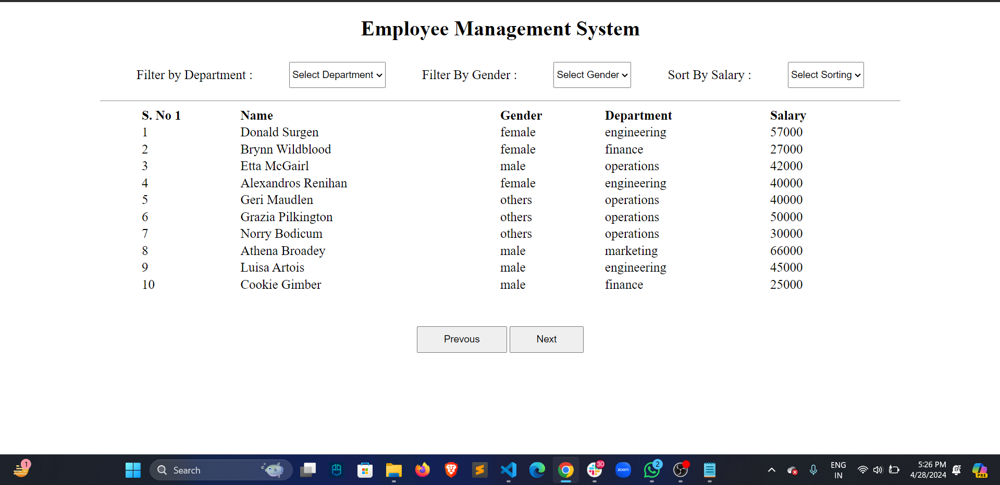

#Buid 
Building a Employee Management System with Filter , Sort and Pagination
Objective
Develop a Employee Management System with features like Dropdown filtering based on department of Employee , gender , sorting based on salary and Pagination .

API Details
Base URL : https://dbioz2ek0e.execute-api.ap-south-1.amazonaws.com/mockapi/get-employees
Query Params :

page - type = number; optional = yes; works : together with limit param; value/values can be : 1,2,3,...

limit - type = number; optional = yes; works : together with page param; value/values can be : 1,2,3,...100 Example using page and limit params https://dbioz2ek0e.execute-api.ap-south-1.amazonaws.com/mockapi/get-employees?page=1&limit=10

filterBy - You can filter by department or gender

filterValue - If filterBy value is gender | filterValue can be male,female,others If filterBy value is department | filterValue can be hr,marketing, finance, engineering, operations

sort - You can sort based on salary

order - Once sort is set to salary , you can sort based on order which can be 'asc' or 'desc'

Example :

https://dbioz2ek0e.execute-api.ap-south-1.amazonaws.com/mockapi/get-employees?page=1&limit=10&filterBy=department&filterValue=hr
https://dbioz2ek0e.execute-api.ap-south-1.amazonaws.com/mockapi/get-employees?page=1&limit=10&filterBy=gender&filterValue=female&sort=salary&order=asc
Core Features
Create an application that fetches the employees data , filters the data by department and gender along with pagination and sorting based on salary.

fetching the employee data and populating(showing) the data on DOM in Table Format , with different rows for each employees. Have these columns

  - S.no
  - Name 
  - Gender 
  - Department 
  - Salary 
Creating filterBy Department feature by using DropDown (select) and filter data based on that . This is how the option should look like :

  --Select Department-- (default option)
      - hr
      - finance
      - marketing
      - engineering
      - operations
  ```

Creating filterBy gender feature by using DropDown (select) and filter data based on that . This is how the option should look like :

  --Select gender-- (default option)
      - male
      - female
  ```
Creating sort by salary feature by using DropDown (select) and sort data based on that . This is how the option should look like :

  --Select order-- (default option)
      - low to high (asc)
      - high to low (desc)
  ```
fetch the data based on limit & page and implement pagination , wherein , whenever user click on next page they should move to next page with next 10 set of data , same for previous , do create disable feature (on first page prev button should be disabled , and on last page next button should be disabled) , also pagination should be working with filter and sort too.

Once the data is filtered either based on department or gender , sorting should be applicable above the filtered data too .

finally after implementing the features you can update the UI to improve user experience , here's an example :